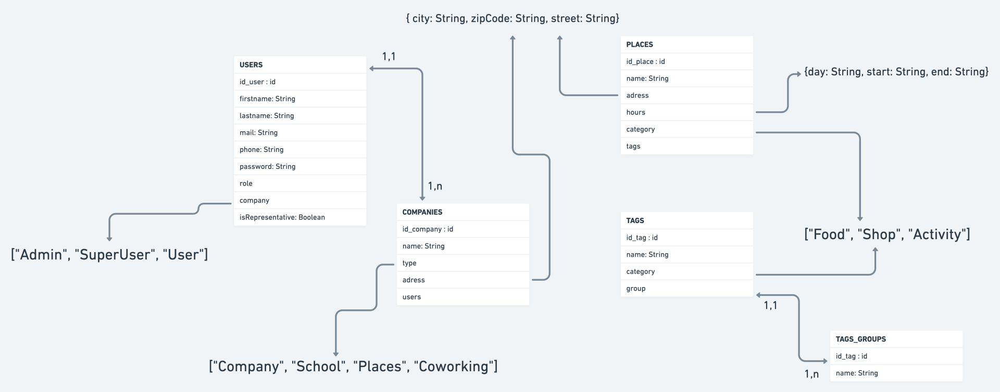

# BACK

## Membres évalués

- [Florian Sahbi](https://github.com/FlorianSahbi)
- [Théodore Yip](https://github.com/yip-theodore)

## Schéma base de donnée
[mongoDB](https://www.mongodb.com/fr) : Pour le stockage de nos données

##### BASE DE DONNEES

Du fait que les exigences initiales en matière de données étaient difficile à déterminer en début de projet. Une base de données NoSQL était la solution la mieux adaptée. En effet, la flexibilité de ce type de db permet d’ajouter à tout moment et très facilement, des données n’importe quand et n’importe où. Ce qui a facilité le début du développement de l’api et son évolution au fil des jours. 

Performances :

* En terme de performance, il faut noter que la représentation des données en collection et le résultat en flux JSON des requêtes permet de consommer les données très rapidement et facilement par les applications front, et ce, même dans les situations où le débit est faible. Toujours avec cette idée de booster les performances et de réduire le temps d’exécution des requêtes, il a été décidé de dénormalisé certaines données. Le principe de « denormalization » induit une représentation plus simple et permet donc de récupérer toutes les informations sur un élément spécifique dans une seule requête. Il n’y a donc pas besoin de liens JOIN ou de requêtes SQL complexes. Il est bon de noté que nous avons quand même respecté à minima la premiere forme normale 1FN qui spécifie que les données qui peuvent l'être, doivent être atomisées.
Pour le nom et le prenom d'un utilisateur nous preferons par exemple une colonne nom et prenom plutot qu'une colonne fusionnant les deux, et dans le cas d'une base nosql cette logique prendra la forme d'un objet JSON avec une clé nom et une clé prenom.

Scalabilité :

* Il semble que les problématiques liées à la répartition de charge posent de réels challenges sur un serveur SQL alors que les modèles de données NoSQL peuvent rendre le processus plus facile grâce à une conception native avec des fonctionnalités de « scalabilité élastique ». L’organisation des données en documents et la « denormalization » des collections permettent le partitionnement et autorise une montée en charge de la base de données sur le matériel courant déployé sur site ou dans le Cloud. Ce qui  permet une croissance pratiquement illimitée.

#### Prisma 

Prisma est un ORM qui nous permet d’interagir d’une manière plus simple avec nos données via une syntaxe objets. Prisma est un outil pour la construction de serveurs GraphQL, ou simplement une couche de données qui transforme une base de données en une API GraphQL. L’outil est semblable aux ORM traditionnels, mais présente en plus d’autres caractéristiques et fonctionnalités que ces derniers ne possèdent pas. Le client Prisma est compatible avec l'écosystème Apollo, prend en charge par défaut les abonnements GraphQL etc... Prisma propose une API en temps réel pour chaque base de données prise en charge, permettant ainsi de nous abonner à tout événement de base de données, tel que la création, la mise à jour ou la suppression de données. L'outil prend également en charge plusieurs bases de données. Ce qui permet d'accéder à toutes ces sources de données au moyen d'une API unique, cohérente et sécurisée.

## Techno et Librairies

- [bcryptjs](https://www.npmjs.com/package/bcryptjs)
: Fonction de hachage pour encoder les mots de passe.
- [graphql-yoga](https://www.npmjs.com/package/graphql-yoga)
: Serveur GraphQL complet, axé sur la facilité d'installation et les performances.

    Graphql-yoga est basé sur : 
    - [express/apollo-server](https://github.com/apollographql/apollo-server)
    - [graphql-subscriptions/subscriptions-transport-ws](https://github.com/apollographql/graphql-subscriptions)
    - [graphql.js/graphql-tools](https://github.com/graphql/graphql-js)
    - [graphql-playground](https://github.com/graphcool/graphql-playground)
- [jsonwebtoken](https://www.npmjs.com/package/jsonwebtoken)
: Voir *Principe d'authentification*
- [nodemailer](https://www.npmjs.com/package/nodemailer)
: Pour permettre l'envoi de d'emails.
- [stripe](https://www.npmjs.com/package/stripe)
: Solution de traitement des paiements en ligne pour les entreprises Internet.
- [prisma](https://www.npmjs.com/package/prisma)
: Prisma génère automatiquement pour nous un client qui nous permet de manipuler notre base de données sans apprendre les spécificités de chaque base de données. Il suffit de connaître la programmation orientée object pour utiliser Prisma. Il est utilisé comme ORM.

dev:

- [faker](https://www.npmjs.com/package/faker)
: Pour rapidement générer nos fixtures avec des données lisisbles.
- [eslint](https://www.npmjs.com/package/eslint)
: Analyse notre code et vérifie que celui-ci respecte un certain nombre de règles.

## Principe d'authentification

- Un call `login` permet de s'authentifier. L'email et le password sont vérifiés et un jwt `x-auth-token` contenant l'id de l'utilisateur correspondant est ajouté dans les cookies du client.
- Un call `checkAuth` est executé des qu'on ouvre l'application back-office. Si un cookie `x-auth-token` est présent dans le header, il est vérifié et renvoie les informations de l'utilisateur en réponse. Côté client, si les informations de l'utilisateur ont été reçu avec succès, on a accès au back-office, sinon on est renvoyé vers la page de login.
- Le call `logout` supprime le cookie `x-auth-token`.

## Lien vers l'api déployée et documentation

http://35.180.197.38:3000/

## Comptes

| role        | email                    | password |
| ----------- | ------------------------ | -------- |
| SUPER_ADMIN | `w3p2020g7@gmail.com`    | `admin`  |
| SUPER_ADMIN | `eric.priou@gmail.com`   | `admin`  |
| ADMIN       | `theodore.yip@hetic.net` | `admin`  |
