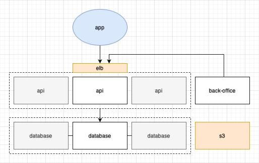

## Documentation / reproduction du déploiement

### Schema


### Commandes

#### Variables environnements

Copier le fichier `.env-example` en `.env` et le remplir avec les variables d'environnement.
```
cp .env-example .env
```
Exporter toutes les variables d’environnement
```
set -a && source .env && set +a
```
Encrypter le `.env`
```
ansible-vault encrypt .env --output .env.encrypted --ask-vault-pass
```
Décrypter le `.env.encrypted`
```
ansible-vault decrypt .env.encrypted --output .env --ask-vault-pass
```

<!-- https://expo.io/@w3p2020g7/madu -->

#### Terraform (à exécuter depuis le dossier terraform)

Créer une paire de clé ssh
```
ssh-keygen -t rsa -b 4096 -f ./id_rsa
```
Ajouter les clés ssh au .env
```
echo "SSH_PUBLIC_KEY=\"$(cat id_rsa.pub)\"" >> ../../.env
echo "SSH_PRIVATE_KEY=\"$(cat id_rsa)\"" >> ../../.env
```
Créer les ressources aws
```
terraform apply -var=ssh_public_key=${SSH_PUBLIC_KEY}
```

#### Ansible (à exécuter depuis le dossier ansible)

Recréer la clé privée depuis la variable d’environnement
```
echo ${SSH_PRIVATE_KEY} > ./id_rsa
chmod 600 ./id_rsa
```
Lancer le playbook ansible pour la première fois
```
ansible-playbook -i inventory/ec2.py -l tag_stage_staging playbook.yml -u ubuntu --key ./id_rsa
ansible-playbook -i inventory/ec2.py -l tag_stage_staging playbook-fixtures.yml -u ubuntu --key ./id_rsa
```
Lancer le playbook pour redéployer
```
ansible-galaxy install -r requirements.yml
chmod +x inventory/ec2.py
ansible-playbook -i inventory/ec2.py tag_stage_staging playbook.yml --tags deploy -u ubuntu --key ./id_rsa
```
<!-- ansible -i inventory/ec2.py -m ping -u ubuntu --key ./id_rsa -->

Ajouter un utilisateur (remplacer les valeurs `{value}`)
```
ansible-playbook -i inventory/ec2.py playbook-insert.yml -u ubuntu --key ./id_rsa -e user_firstName={value} -e user_lastName={value} -e user_email={value} -e user_password={value}
```

<details>

Créer une paire de clé ssh
```
ssh-keygen -t rsa -b 4096 -f ./id_rsa
```
Ajouter les clés ssh au .env
```
echo "SSH_PUBLIC_KEY=\"$(cat id_rsa.pub)\"" >> ../.env
echo "SSH_PRIVATE_KEY=\"$(cat id_rsa)\"" >> ../.env
```
Créer les ressources aws
```
terraform apply -var=ssh_public_key=${SSH_PUBLIC_KEY}
```
Recréer la clé privée depuis la variable d’environnement
```
echo ${SSH_PRIVATE_KEY} > ./id_rsa
chmod 600 ./id_rsa
```
Lancer le playbook ansible pour la première fois
```
ansible-playbook -i inventory/ec2.py staging.yml -u ubuntu --key ./id_rsa
ansible-playbook -i inventory/ec2.py playbook-fixtures.yml -u ubuntu --key ./id_rsa
```
Lancer le playbook pour redéployer
```
ansible-playbook -i inventory/ec2.py staging.yml --tags deploy -u ubuntu --key ./id_rsa
```
Construire et pousser les images Docker en local
```
docker build -t $DOCKER_USERNAME/madu_api:latest ./api
docker push $DOCKER_USERNAME/madu_api:latest
docker build -t $DOCKER_USERNAME/madu_back-office:latest ./back-office --build-arg REACT_APP_API_URL=http://elb-1509450197.eu-west-2.elb.amazonaws.com
docker push $DOCKER_USERNAME/madu_back-office:latest
```
Remplacer les sauts de lignes par le charactère `\n`
```
awk -v ORS='\\n' '1' id_rsa >> ../.env
echo "SSH_PRIVATE_KEY=\"$(awk -v ORS='\\\\n' '1' id_rsa)\"" >> ../.env
```
Entrer dans un container docker
```
docker exec -it 220f53f15465 bash
```
Publier l’app sur expo
```
expo login
REACT_APP_API_URL=http://elb-1509450197.eu-west-2.elb.amazonaws.com && expo publish
```

</details>
